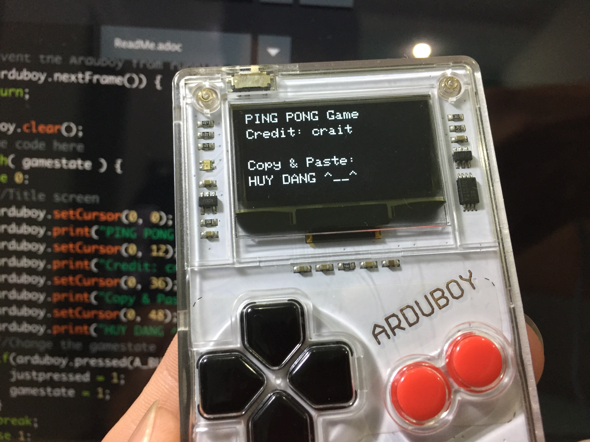
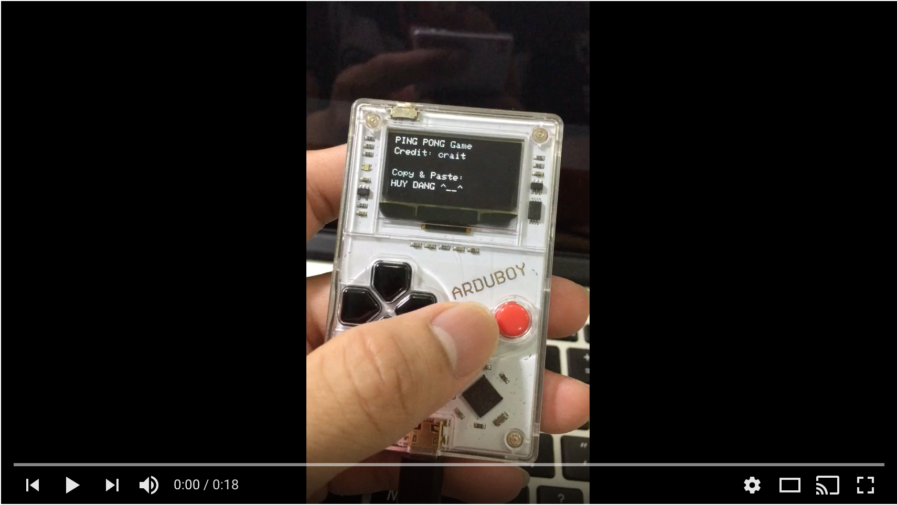

# Ping Pong game

**Ping Pong** game for Arduboy

Credit to [crait](http://www.twitter.com/crait), I'm just following his awesome tutorial [here](https://community.arduboy.com/t/make-your-own-arduboy-game-part-7-make-pong-from-scratch/2615) and make some text changes :-) But it's fun.

## In this project, I learnt

- [x] Set up the new sketch
- [x] Create a title screen, game screen, win screen, and lose screen
- [x] Create a ball that bounces around the screen
- [x] Create and control a paddle
- [x] Create the computer’s paddle
- [x] Programming collision
- [x] Adjusting the AI
- [x] Scoring
- [x] Creating a new ball and resetting the game

## Screenshot

## Video Walkthrough

## License

    Copyright [2018] [Huy Dang]

    Licensed under the Apache License, Version 2.0 (the "License");
    you may not use this file except in compliance with the License.
    You may obtain a copy of the License at

        http://www.apache.org/licenses/LICENSE-2.0

    Unless required by applicable law or agreed to in writing, software
    distributed under the License is distributed on an "AS IS" BASIS,
    WITHOUT WARRANTIES OR CONDITIONS OF ANY KIND, either express or implied.
    See the License for the specific language governing permissions and
    limitations under the License.